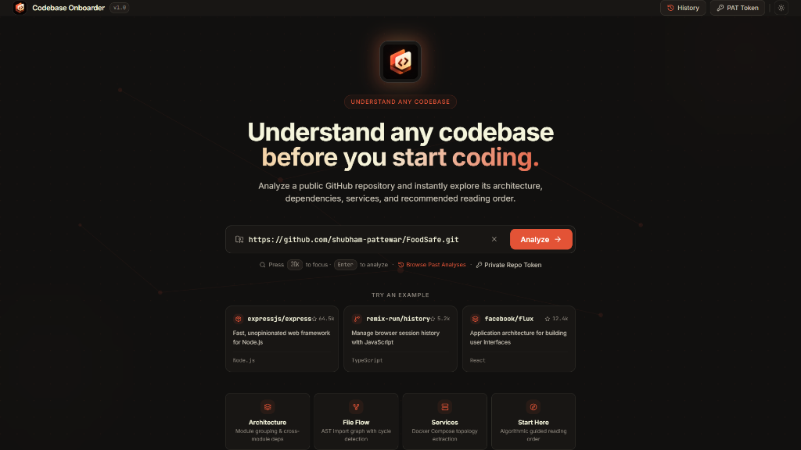
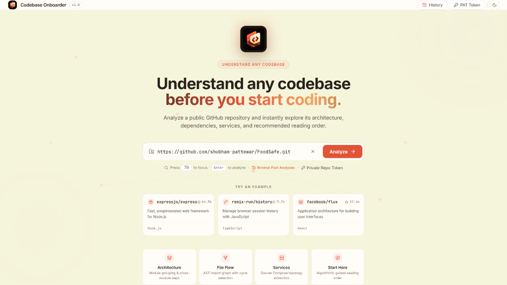
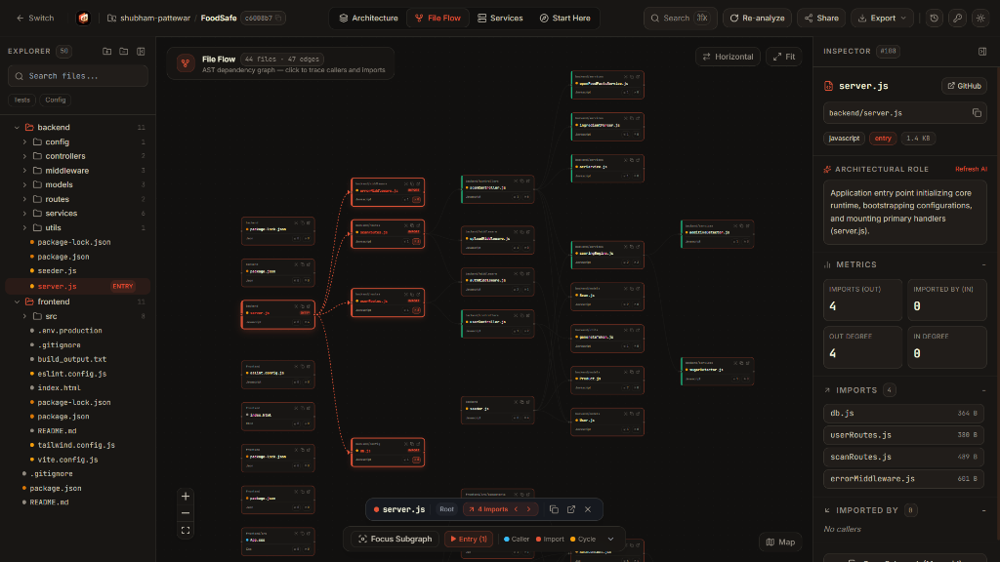
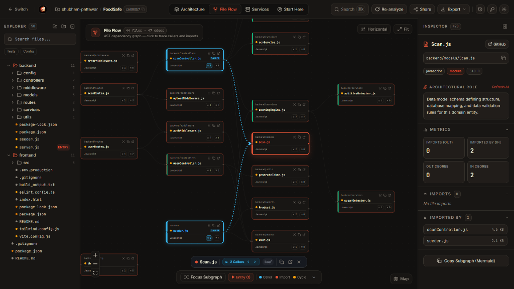
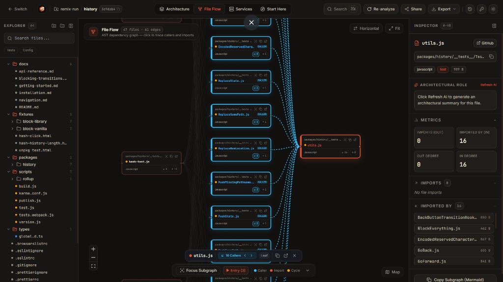
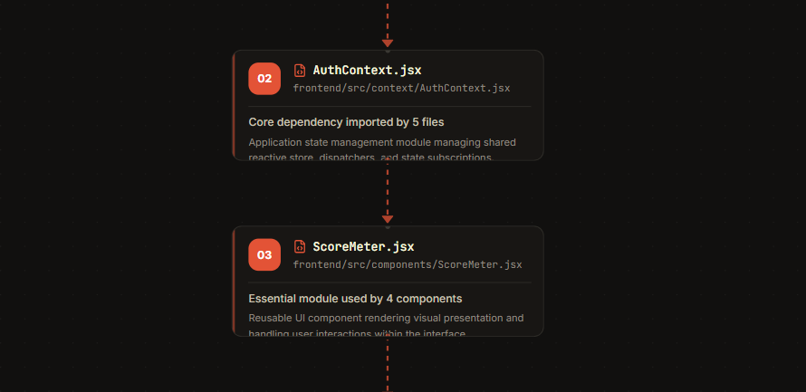
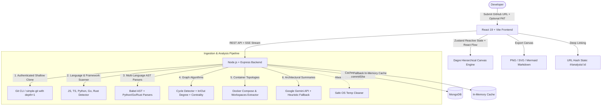

# ⚡ Codebase Onboarder

<p align="center">
  
</p>

<p align="center">
  <strong>Understand any codebase before you start coding.</strong><br>
  Instant architecture visualization, multi-language AST dependency flow, container topologies, and algorithmic guided reading order for any GitHub repository.
</p>

<p align="center">
  
  
  
  
  
  
  
  
</p>

---

## 📑 Table of Contents

- [Overview](#-overview)
- [Visual Showcase](#-visual-showcase)
- [The 4 Core Views](#-the-4-core-views)
- [Key Features](#-key-features)
  - [Interactive File Flow & Dependency Tracing](#interactive-file-flow--dependency-tracing)
  - [Multi-Language AST Parsing](#multi-language-ast-parsing)
  - [Algorithmic "Start Here" Reading Order](#algorithmic-start-here-reading-order)
  - [Private Repositories via GitHub PAT](#private-repositories-via-github-pat)
  - [AI Architectural Summaries](#ai-architectural-summaries)
  - [Exporting & Deep Shareable URLs](#exporting--deep-shareable-urls)
- [System Architecture](#-system-architecture)
- [Monorepo Directory Structure](#-monorepo-directory-structure)
- [Quickstart Guide](#-quickstart-guide)
  - [Option A: Local Development](#option-a-local-development)
  - [Option B: Docker Compose](#option-b-docker-compose)
  - [Environment Variables](#environment-variables)
- [Running Tests](#-running-tests)
- [API Reference](#-api-reference)
- [Keyboard Shortcuts](#-keyboard-shortcuts)
- [Security & Ephemeral Isolation](#-security--ephemeral-isolation)

---

## 🚀 Overview

Onboarding to a new codebase typically requires hours of manual digging: tracing imports across nested directories, finding entry points, piecing together Docker Compose topologies, and deciphering circular dependencies.

**Codebase Onboarder** solves this by converting any public or private GitHub repository into an interactive, high-fidelity developer workspace. Powered by static AST parsing, graph algorithms, and responsive visualization engines, it gives developers a Canva/Figma-style interactive canvas to explore architectures, trace dependencies, isolate subgraphs, and follow a prioritized reading order.

---

## 📸 Visual Showcase

### 1. Unified Landing Experience (Dark & Light Modes)
Instant repository analysis with quick-start templates, private repository personal access token (PAT) configuration, analysis history browser, and light/dark theme switching.

| Dark Theme (Default) | Light Theme |
|:---:|:---:|
|  |  |

---

### 2. Interactive File Flow & Studio Workspace
A 3-column studio layout featuring:
- **Left Sidebar**: Collapsible file tree with folder file counts, entry point flags, and test/config quick filters.
- **Center Canvas**: Interactive React Flow canvas with Dagre hierarchical positioning, minimap toggle, and floating flow tools.
- **Right Details Inspector**: Deep architectural role summary, in/out degree metrics, direct GitHub links, and upstream/downstream import lists.

<p align="center">
  
</p>

---

### 3. Directional Dependency Tracing & Subgraph Isolation
Clicking any node instantly highlights:
- **Upstream Callers** (incoming files importing this file) glowing in **Sky Blue** (`#38BDF8`).
- **Downstream Dependencies** (outgoing imports needed by this file) glowing in **Warm Coral** (`#E35336`).
- **Circular Dependencies** flagged in **Amber** (`#F59E0B`).
- All unrelated nodes and edges smoothly dim to 0.15 opacity, giving immediate clarity to complex data pathways.
- One-click **Copy Subgraph (Mermaid)** button copies ready-to-share markdown diagrams directly to your clipboard.

<p align="center">
  
</p>

---

### 4. Large-Scale Multi-Caller Traceability
Seamlessly scales across production repositories (such as `remix-run/history`, `expressjs`, or `facebook/flux`), mapping high-traffic utility nodes with 15+ caller references and smooth bezier edge curves.

<p align="center">
  
</p>

---

### 5. Algorithmic "Start Here" Reading Order
Takes the guesswork out of where to begin reading a new codebase. Algorithmic scoring orders files sequentially (01 &rarr; 02 &rarr; 03...) based on entry point classification and in-degree centrality, pairing each step with a clear rationale.

<p align="center">
  
</p>

---

## 🗺️ The 4 Core Views

| View | Mode | Purpose | Details |
|---|---|---|---|
| **Architecture View** | `architecture` | High-Level System Structure | Groups files into top-level modules/packages and visualizes inter-module relationships. |
| **File Flow View** | `file-flow` | Granular AST Dependency Graph | Interactive file-by-file import graph with caller/dependency highlighting, subgraph isolation, and circular loop detection. |
| **Services View** | `services` | Container & Service Topology | Extracts container services, exposed ports, environment configurations, and `depends_on` bindings from `docker-compose.yml` and Dockerfiles. |
| **Start Here View** | `start-here` | Guided Onboarding Walkthrough | Deterministic sequential reading list prioritizing configuration, core state, entry points, and domain models. |

---

## ⚡ Key Features

### Interactive File Flow & Dependency Tracing
- **Zero-Jump Camera Selection**: Selecting or clicking nodes updates details and traces connections without auto-panning or shifting the viewport.
- **Directional Glow Indicators**:
  - Sky Blue (`#38BDF8`) for upstream callers.
  - Coral (`#E35336`) for downstream dependencies.
  - Unconnected nodes dim into the background.
- **Floating Flow Tools Dock**:
  - **Focus Subgraph**: Collapse distant nodes to a 1-hop or 2-hop radius around the active selection.
  - **Entry Points Stepper**: `⚡ Entry (N)` button quickly cycles through all detected entry points (`server.ts`, `main.py`, `index.ts`).
  - **Circular Dependency Focus**: `🔄 Cycle (N)` isolates import loops.
  - **Edge Tooltips**: Hover over any connector line to inspect the exact `Source ── imports ──▶ Target` relationship.

### Multi-Language AST Parsing
- **TypeScript & JavaScript**: Full AST parsing via `@babel/parser` and `@babel/traverse`. Supports ES Modules (`import`), dynamic `import()`, CommonJS (`require()`), and `tsconfig.json` path mappings (`@/*`, `~/*`).
- **Python**: Resolves `import foo`, `from package import bar`, relative imports (`from . import db`, `from ..models import User`), and package module initializers (`__init__.py`).
- **Go**: Full Go import block parser supporting `import "pkg"` and internal workspace module resolution via `go.mod`.
- **Rust**: Resolves module declarations (`mod foo;`), crate imports (`use crate::...`), and relative paths (`use super::...`) to `.rs` and `mod.rs` files.
- **Framework Detection**: Detects Express, Next.js, React, NestJS, FastAPI, Flask, Django, Gin, Echo, Fiber, Actix-web, Axum, Tokio, and Docker.

### Algorithmic "Start Here" Reading Order
- Ranks files based on **in-degree centrality**, **topological order**, and **entry point classification**.
- Renders in a clean, vertical reading sequence with numbered step badges, full filepaths, and natural language architectural explanations.

### Private Repositories via GitHub PAT
- Authenticate using a GitHub Personal Access Token (classic `repo` scope or fine-grained `Contents: Read`).
- Overcomes GitHub's 60 req/hr anonymous IP limit (grants up to 5,000 req/hr).
- **Client-Side Only**: PATs are stored exclusively in the browser's `localStorage` and sent via encrypted request headers during clone operations—never stored in MongoDB.

### AI Architectural Summaries
- **Gemini Batch Summarization**: Summarizes each file's architectural role within the codebase using Google Gemini (`gemini-1.5-flash` / `gemini-2.0-flash`).
- **Heuristic Fallback Engine**: If no API key is provided, an offline rule-based classifier assigns roles based on AST markers, exports, and directory heuristics with zero downtime.
- **On-Demand Refresh**: Single-click "Refresh AI" button in the inspector panel to re-summarize any specific file.

### Exporting & Deep Shareable URLs
- **Export Formats**: Export visual diagrams as high-resolution PNG, SVG, or Mermaid diagram markdown.
- **URL Hash Synchronization**: Every analysis automatically syncs with shareable URL hash routes (`/#/analysis/:id`).
- **One-Click Share**: Built-in TopBar share button copies deep-links with instant visual confirmation.

---

## 🏛️ System Architecture



---

## 📁 Monorepo Directory Structure

```
c:\CODEONBOARDER/
├── client/                     # React 19 Frontend
│   ├── src/
│   │   ├── components/
│   │   │   ├── canvas/         # React Flow Graph Canvas & Flow Tools Dock
│   │   │   │   ├── nodes/      # Custom FileNode, StartHereNode, ServiceNode
│   │   │   │   └── GraphCanvas.tsx
│   │   │   ├── layout/         # TopBar, LeftSidebar, RightDetailsPanel, Modals
│   │   │   └── landing/        # Hero Section, Quick Examples, Feature Cards
│   │   ├── store/              # Zustand Reactive Analysis Store
│   │   ├── services/           # Axios API Client & SSE Event Source
│   │   └── types/              # TypeScript Graph & Analysis Interfaces
│   ├── vite.config.ts
│   └── package.json
├── server/                     # Node.js + Express Backend
│   ├── src/
│   │   ├── controllers/        # Analysis, Jobs, and Export Handlers
│   │   ├── services/
│   │   │   ├── gitService.ts   # Ephemeral Shallow Clone & Token Auth
│   │   │   ├── parserService.ts# Babel, Python, Go, Rust AST Parsers
│   │   │   ├── graphService.ts # Degree Centrality, Cycles, Reading Order
│   │   │   ├── aiService.ts    # Gemini Batch Summaries + Offline Heuristics
│   │   │   └── composeService.ts # Docker Compose Topology Parser
│   │   ├── models/             # Mongoose Analysis Schema
│   │   └── routes/             # REST API Endpoints
│   └── package.json
├── docs/
│   └── images/                 # High-resolution screenshots for documentation
├── e2e/                        # Playwright End-to-End Test Suites
├── docker-compose.yml          # Containerized Multi-Service Deployment
└── package.json                # Monorepo Workspace Configuration
```

---

## 🛠️ Quickstart Guide

### Option A: Local Development

#### Prerequisites
- **Node.js** >= 18.0.0
- **Git** installed on host system
- **MongoDB** running locally (`mongodb://localhost:27017/codebase-onboarder`) or uses automatic in-memory fallback.

#### 1. Clone the repository and install dependencies
```bash
git clone https://github.com/shubham-pattewar/Codebase-Onboarder.git
cd Codebase-Onboarder
npm install
```

#### 2. Start Backend and Frontend concurrently
```bash
npm run dev:all
```
- **Frontend App**: [http://localhost:5173](http://localhost:5173)
- **Backend API**: [http://localhost:4000/api/health](http://localhost:4000/api/health)

---

### Option B: Docker Compose

```bash
docker compose up --build
```
Spins up MongoDB, Express API server, and Vite client in isolated containers.

---

### Environment Variables

Create a `.env` file in `server/`:

```env
PORT=4000
MONGODB_URI=mongodb://localhost:27017/codebase-onboarder
LLM_API_KEY=your_gemini_api_key_here    # Optional: for Gemini AI summaries (has heuristic fallback)
CLIENT_URL=http://localhost:5173
```

---

## 🧪 Running Tests

### Unit Tests (Vitest)
Executes unit tests for AST parsers, relative import resolution, cycle detection, and degree centrality:
```bash
npm run test
```

### End-to-End Tests (Playwright)
Executes end-to-end tests validating landing page input, view mode switching, search highlighting, and node selection:
```bash
npm run test:e2e
```

---

## 📡 API Reference

| Method | Endpoint | Payload / Query | Description |
|---|---|---|---|
| `POST` | `/api/analyze` | `{ repoUrl, githubToken?, forceRefresh? }` | Starts analysis or retrieves cached graph. Supports private repo PATs. |
| `GET` | `/api/analyze/jobs/:id` | — | Polls job progress status (`cloning`, `scanning`, `building_graph`, `done`). |
| `GET` | `/api/analyze/jobs/:id/events` | — | Real-time Server-Sent Events (SSE) progress stream. |
| `GET` | `/api/analysis` | — | Retrieves list of past repository analyses for the History modal. |
| `GET` | `/api/analysis/:id` | — | Fetches complete analysis payload (nodes, edges, modules, services, reading order). |
| `POST` | `/api/analysis/:id/file-summary` | `{ filePath }` | Generates or refreshes an on-demand AI architectural summary for a file. |
| `GET` | `/api/analysis/:id/export` | `?format=mermaid` | Exports the full dependency graph in Mermaid markdown syntax. |
| `GET` | `/api/health` | — | Health check endpoint returning uptime and database status. |

---

## ⌨️ Keyboard Shortcuts

| Shortcut | Action |
|---|---|
| <kbd>⌘K</kbd> or <kbd>Ctrl+K</kbd> | Open Command Palette / Focus File Search |
| <kbd>1</kbd> | Switch to **Architecture View** |
| <kbd>2</kbd> | Switch to **File Flow View** |
| <kbd>3</kbd> | Switch to **Services View** |
| <kbd>4</kbd> | Switch to **Start Here View** |
| <kbd>Esc</kbd> | Close open modals (History, PAT, Inspector, Command Palette) |
| <kbd>Enter</kbd> | Submit repository URL for analysis |

---

## 🔒 Security & Ephemeral Isolation

- **Zero Remote Code Execution**: Static AST and manifest analysis only. No untrusted code or scripts are ever executed.
- **Strict Size Guardrails**: Repositories exceeding 60MB are rejected prior to cloning via GitHub API metadata checks.
- **Clone Timeout Limits**: Enforces a strict 30-second clone timeout to prevent hanging on oversized repositories.
- **Ephemeral Shallow Clones**: Repositories are cloned shallowly (`--depth 1`) into unique OS temporary directories and purged immediately inside `finally` blocks.
- **PAT Privacy**: GitHub Personal Access Tokens are stored solely in the user's browser `localStorage` and never logged or stored in the database.

---

<p align="center">
  Built with ❤️ for developers exploring new codebases.
</p>
